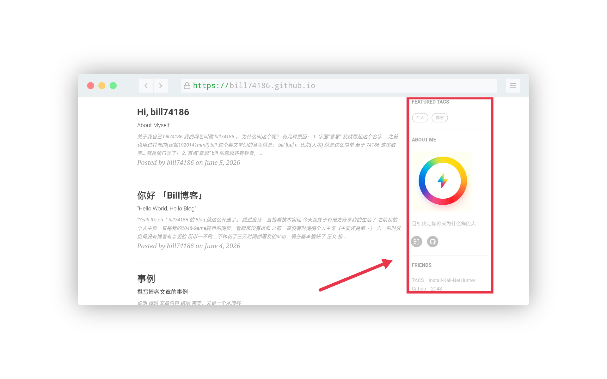
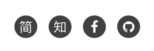
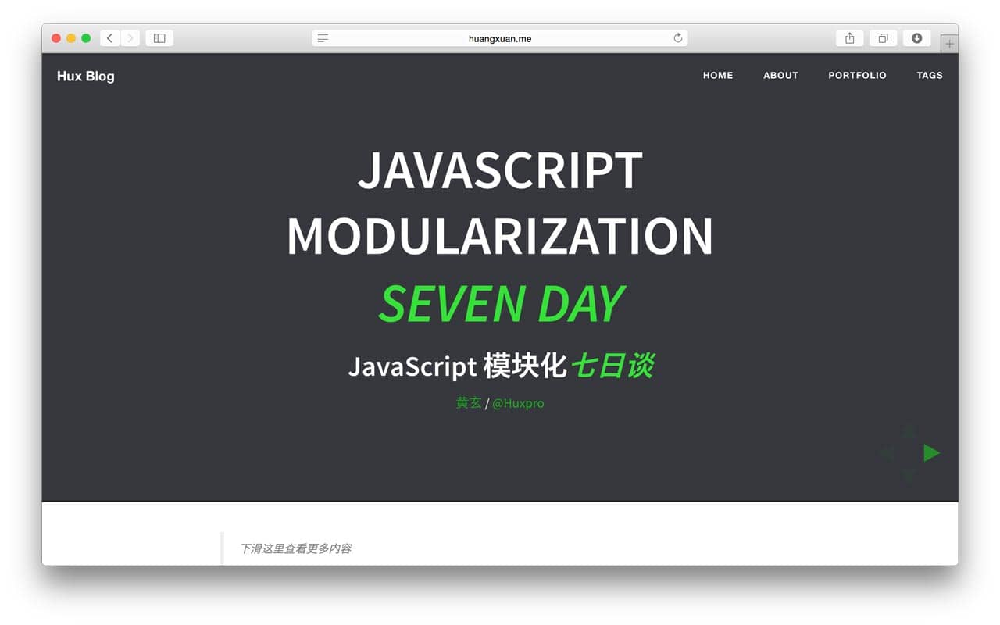

<div align="center">

# Bill Blog
「一“码”之缘，有“源”再见！」


<p>
  
  
  
  
  
</p>

[English](../README.md) | **简体中文** | [繁體中文](README.zhTW.md)

<p>
  <a href="https://github.com/bill74186/bill74186.github.io/stargazers"></a>
  <a href="https://github.com/bill74186/bill74186.github.io/network/members"></a>
  <a href="LICENSE"></a>
</p>

</div>

>
### [查看博客戳这里 👆](http://bill74186.github.io)

> ![tip]
>博客的搭建教程修改自 [Hux](https://github.com/Huxpro/huxpro.github.io)<br>
>博客模板也修改自 [Hux Blog](https://github.com/huxpro.github.io)<br>
>有兴趣可以看看原版教程

## 使用

* 开始
	* [环境](#环境)
	* [开始](#开始)
	* [撰写博文](#撰写博文)
* 组件
	* [侧边栏](#侧边栏)
	* [迷你关于我](#迷你关于我)
	* [推荐标签](#推荐标签)
	* [SNS 设置](#SNS-设置)
	* [好友链接](#好友链接)
	* [演示文档布局](#演示文档布局)
* 评论与网站分析
	* [评论](#评论系统)
	* [网站分析](#统计分析) 
* 高级部分
	* [自定义](#customization)
	* [标题底图](#标题底图)
	* [搜索展示标题-头文件](#头文件修改)

## 开始

### 环境

如果你安装了 [jekyll](http://jekyllcn.com/)，那你只需要在命令行输入`jekyll serve` 或 `jekyll s`就能在本地浏览器中输入`http://127.0.0.1:4000/`预览主题，对主题的修改也能实时展示（需要强刷浏览器）。


### 开始

你可以通用修改 `_config.yml`文件来轻松的开始搭建自己的博客:

```yaml
# 网站设置
title: Bill Blog    # 你的博客网站标题
SEOTitle: bill74186的博客 | Bill Blog    # SEO 标题
description: "Hey"    # 随便说点，描述一下

# SNS 设置
zhihu_username: bill74186    # 你的知乎名称
github_username: bill74186    # 你的 GitHub 名称

# 配置设置
# paginate: 10    # 一页你准备放几篇文章
```

Jekyll官方网站还有很多的参数可以调，比如设置文章的链接形式...网址在这里：[Jekyll - Official Site](http://jekyllrb.com/) 中文版的在这里：[Jekyll中文](http://jekyllcn.com/)。

### 撰写博文

要发表的文章一般以 **Markdown** 的格式放在这里`_posts/`，你只要看看这篇模板里的文章你就立刻明白该如何设置。

yaml 头文件长这样:

```

---
layout:     post
title:      "你好 「Bill博客」"
subtitle:   " \"Hello World, Hello Blog\""
date:       2026-06-04 
author:     "bill74186"
header-img: "img/offline-bg.jpg"
catalog: true
tags:
    - 博客
---
```

## 组件

### 侧边栏

看右边:


设置是在 `_config.yml`文件里面的`侧边栏设置`那块。

```yaml
# 侧边栏设置
sidebar: true  #添加侧边栏
sidebar-about-description: "简单的描述一下你自己"
sidebar-avatar: /img/bill74186.jpg     #你的大头贴，请使用绝对地址.注意：名字区分大小写！后缀名也是
```

侧边栏是响应式布局的，当屏幕尺寸小于992px的时候，侧边栏就会移动到底部。具体请见bootstrap栅格系统 <http://v3.bootcss.com/css/>


### 迷你关于我

Mini-About-Me 这个模块将在你的头像下面，展示你所有的社交账号。这个也是响应式布局，当屏幕变小时候，会将其移动到页面底部，只不过会稍微有点小变化，具体请看代码。

### 推荐标签

看到这个网站 [Medium](http://medium.com) 的推荐标签非常的炫酷，所以我将他加了进来。
这个模块现在是独立的，可以呈现在所有页面，包括主页和发表的每一篇文章标题的头上。

```yaml
# 推荐标签
featured-tags: true  
featured-condition-size: 1
```

唯一需要注意的是`featured-condition-size`: 如果一个标签的 SIZE，也就是使用该标签的文章数大于上面设定的条件值，这个标签就会在首页上被推荐。
 
内部有一个条件模板 `` 是用来做筛选过滤的.

### SNS 设置

在下面输入的社交账号，没有的添加的不会显示在侧边框中。

```yaml
	# SNS 设置
	RSS: false
    weibo_username: bill74186
    jianshu_username: bill74186
    zhihu_username: bill74186
    github_username: bill74186
    twitter_username: bill74186
    facebook_username: bill74186
    linkedin_username: firstname-lastname-idxxxx
```



### 好友链接

好友链接部分。这会在全部页面显示。

设置是在 `_config.yml`文件里面的`Friends`那块，自己加吧。

```yaml
# 好友链接
friends: [
    { title: "Github", href: "https://github.com/"},
    { title: "2048", href: "https://bill74186.github.io/2048-Game/"}
]
```


### 演示文档布局



这部分是用于占用html格式的幻灯片的，一般用到的是 Reveal.js, Impress.js, Slides, Prezi 等等.我认为一个现代化的博客怎么能少了放html幻灯的功能呢~

其主要原理是添加一个 `iframe`，在里面加入外部链接。你可以直接写到头文件里面去，详情请见下面的yaml头文件的写法。

```

---
layout:     keynote
iframe:     "http://huangxuan.me/js-module-7day/"
---
```

iframe在不同的设备中，将会自动的调整大小。保留内边距是为了让手机用户可以向下滑动，以及添加更多的内容。


### 评论系统

本博客已基本支持了以下③种不同类型的评论系统：
- `giscus`
- `utterances`
- `gitalk`

大家可以自由选择您需要的评论系统，详细代码可以查看`_config.yml`的内容：

```yaml
# 评论开关
comments: [true/false]

giscus:
  enable: [true/false]
  repo: "username/reponame"
  repo_id: "[Repository ID]"
  category: "[Category Name]"
  category_id: "[Category ID]"
  mapping: "[pathname/url/title]"
  strict: [0/1]
  reactions_enabled: [0/1]
  emit_metadata: [0/1]
  input_position: "[top/bottom]"
  theme: "[light/dark/custom]"
  lang: "[zh-CN/en-US/other]"
  loading: "[lazy/eager]"

utterances:
  enable: [true/false]
  repo: "username/reponame"
  issue_term: "pathname"
  label: "[Comment/other]"
  theme: "[github-light/other]"

gitalk:
  enable: [true/false]
  clientID: "[Client ID]"
  clientSecret: "[Client Secret]"
  repo: "username/reponame"
  owner: "[Owner Name]"
  admin: "[Admin Account]"
  distractionFreeMode: [true/false]
```

> ![note]
> 这里写的是建议值，请按实际修改

### 统计分析

网站分析，现在支持百度统计和Google Analytics。需要去官方网站注册一下，然后将返回的code贴在下面：

```yaml
# Baidu Analytics
ba_track_id: [your-baId-id]

# Google Analytics
ga_track_id: 'UA-xxxxxx-xx'            # 你用Google账号去注册一个就会给你一个这样的id
ga_domain: auto			# 默认的是 auto, 这里我是自定义了的域名，你如果没有自己的域名，需要改成auto。
```

### 自定义

如果你喜欢折腾，你可以去自定义这个模板的 Code。

**如果你可以理解 `_include/` 和 `_layouts/`文件夹下的代码（这里是整个界面布局的地方），你就可以使用 Jekyll 使用的模版引擎 [Liquid](https://github.com/Shopify/liquid/wiki)的语法直接修改/添加代码，来进行更有创意的自定义界面啦！**

### 标题底图

博客每页的标题底图是可以自己选的，看看几篇示例post你就知道如何设置了。
  
标题底图的选取完全是看个人的审美了。每一篇文章可以有不同的底图，你想放什么就放什么，最后宽度要够，大小不要太大，否则加载慢啊。

> 上传的图片最好先压缩，这里推荐 imageOptim 图片压缩软件，让你的博客起飞。

但是需要注意的是本模板的标题是**白色**的，所以背景色要设置为**灰色**或者**黑色**，总之深色系就对了。当然你还可以自定义修改字体颜色，总之，用github pages就是可以完全的个性定制自己的博客。

### 头文件修改

我的博客标题是 **“Bill Blog”** 但是我想要在搜索的时候显示 **“bill74186的博客 | Bill Blog”** ，这个就需要 SEO Title 来定义了。

其实这个 SEO Title 就是定义了`<head><title>标题</title></head>`这个里面的东西和多说分享的标题，你可以自行修改的。

### 关于收到"Page Build Warning"的 Email

由于jekyll升级到3.0.x,对原来的 pygments 代码高亮不再支持，现只支持一种-rouge，所以你需要在 `_config.yml`文件中修改`highlighter: rouge`.另外还需要在`_config.yml`文件中加上`gems: [jekyll-paginate]`.

同时,你需要更新你的本地 jekyll 环境.

使用`jekyll server`的同学需要这样：

1. `gem update jekyll` # 更新jekyll
2. `gem update github-pages` #更新依赖的包

使用`bundle exec jekyll server`的同学在更新 jekyll 后，需要输入`bundle update`来更新依赖的包.

> Note：
> 可以使用 `jekyll -s` 命令在本地实时配置博客，提高效率。详见 [Jekyll.com](http://jekyllcn.com/)

参考文档：[using jekyll with pages](https://help.github.com/articles/using-jekyll-with-pages/) & [Upgrading from 2.x to 3.x](http://jekyllrb.com/docs/upgrading/2-to-3/)


## 致谢

1. 这个模板是从这里 [Hux](https://github.com/Huxpro/huxpro.github.io) fork 的, 感谢这个作者。 
2. 感谢 Jekyll、Github Pages 和 Bootstrap!

## License

遵循 MIT 许可证。有关详细,请参阅 [LICENSE](LICENSE)。
